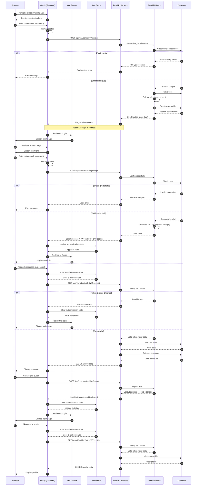

# Authentication Architecture Diagram

<authentication_analysis>
# Authentication Analysis for VibeTravels

## 1. Authentication Flows
Based on the provided documents and code analysis, the following authentication flows were identified:

1. **Registration Flow**: 
   - New user registration through `/api/v1/users/auth/register`
   - Email and password validation
   - User profile creation (handled by `on_after_register` hook)
   - Successfully registered users can proceed to login or are automatically logged in

2. **Login Flow**:
   - User authentication through `/api/v1/users/auth/jwt/login`
   - Credential validation
   - JWT token generation and storage in HTTP-only cookie
   - User redirection to the main application view

3. **Session Validation Flow**:
   - Each API request automatically includes JWT cookie
   - Backend validates JWT for protected endpoints
   - User can access protected resources if JWT is valid

4. **Logout Flow**:
   - User initiates logout through `/api/v1/users/auth/jwt/logout`
   - JWT cookie clearing
   - Redirection to login page

5. **Current User Information Flow**:
   - Retrieving current user data through `/api/v1/users/me` 
   - Used for displaying user information and verifying authentication status

## 2. Main Actors and Interactions

1. **Frontend (Browser/Vue.js)**:
   - Handles user interface for login/registration forms
   - Manages authentication state via AuthStore
   - Redirects users based on authentication status
   - Automatically sends JWT cookie with requests

2. **Backend (FastAPI)**:
   - Processes authentication requests 
   - Validates credentials against database
   - Issues JWT tokens upon successful authentication
   - Protects resources with authentication middleware
   - Handles profile creation after registration

3. **FastAPI Users**:
   - Provides authentication backends and strategies
   - Manages JWT token generation and validation
   - Offers user management functionality
   - Provides route protection via dependencies

4. **Cookie Transport**:
   - Handles JWT token storage in HTTP-only cookies
   - Manages cookie attributes for security

## 3. Token Verification and Refresh Process

- **Token Verification**:
  - JWT token is sent with every request as an HTTP-only cookie
  - `fastapi_users` middleware extracts and validates the token
  - Token expiry is checked
  - If valid, user information is available via `current_active_user` dependency
  - If invalid/expired, 401 Unauthorized response is returned

- **Token Lifetime**:
  - JWT lifetime is set to 7 days (per config.py) though PRD specifies 30 days
  - No explicit token refresh mechanism is implemented
  - User must re-authenticate after token expiration

## 4. Authentication Steps

1. **Registration**:
   - User submits email and password through registration form
   - Frontend validates data and sends to `/api/v1/users/auth/register`
   - Backend validates request and creates user account
   - `on_after_register` hook creates user profile
   - 201 Created response with user data

2. **Login**:
   - User enters credentials in login form
   - Frontend sends data to `/api/v1/users/auth/jwt/login`
   - Backend validates credentials
   - On success, JWT is issued in HTTP-only cookie
   - Frontend updates authentication state
   - User is redirected to dashboard/notes view

3. **Protected Resource Access**:
   - Frontend requests protected resource (e.g., notes)
   - JWT cookie is automatically included in request
   - Backend extracts and validates JWT
   - If valid, `current_active_user` dependency provides user information
   - Backend processes request with user context
   - On invalid/expired JWT, 401 Unauthorized response

4. **Logout**:
   - User clicks logout button
   - Frontend sends request to `/api/v1/users/auth/jwt/logout`
   - Backend invalidates session and clears cookie
   - Frontend updates authentication state
   - User is redirected to login page
</authentication_analysis>

This sequence diagram illustrates the main authentication flows in the VibeTravels application according to the architecture specification. The diagram shows interactions between the browser, Vue.js components, FastAPI backend, and database, covering registration, login, protected resource access, logout, and user profile retrieval scenarios.
