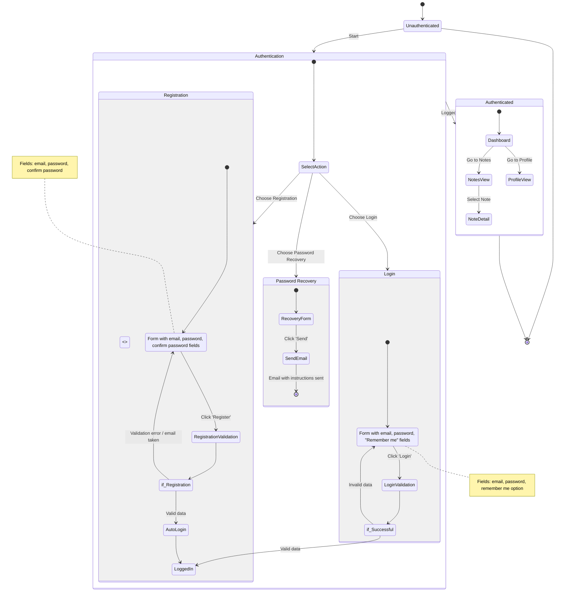

<!-- filepath: /Users/patrykwiener/Code/10xdevs/vibe-travel/.ai/diagrams/journey.md -->
<user_journey_analysis>
1. Enumerated user flows:
   - Access as an unauthenticated user (redirect to login or registration page)
   - Login process (successful and unsuccessful attempts)
   - Registration process (valid data, unique email validation, failed validation)
   - Password recovery (email submission form; future feature, not implemented in MVP)
   - Access as an authenticated user (Dashboard, Notes, Profile)

2. Main journeys and states:
   - Unauthenticated: initial state for new and unauthorized visitors
   - Authentication: action selection (Login, Registration, Password Recovery)
   - Login: form, validation, decision on data correctness
   - Registration: form, validation, decision on data correctness, automatic login
   - Password Recovery: email submission form for password reset instructions
   - Authenticated: access to main application (Dashboard) and views for Notes and Profile

3. Decision points and alternative paths:
   - if_Successful (choice) in the login process: directs to success or back to the form
   - if_Registration (choice) in the registration process: transitions to automatic login or back with errors
   - Ability to choose between Login, Registration, and Password Recovery in the Authentication state

4. Brief description of each state:
   - Unauthenticated: the client has no session and must log in or register
   - SelectAction: entry point allowing the user to decide what to do
   - LoginForm: collects user credentials
   - LoginValidation: checks entered credentials
   - RegistrationForm: collects data to create a new account
   - RegistrationValidation: verifies data correctness and uniqueness
   - AutoLogin: option to log in immediately after registration
   - RecoveryForm: collects the user's email for sending a reset link
   - SendEmail: sends password reset instructions via email
   - Authenticated: the user has access to application features after authentication
   - Dashboard: main navigation hub after login
</user_journey_analysis>

<mermaid_diagram>

</mermaid_diagram>
