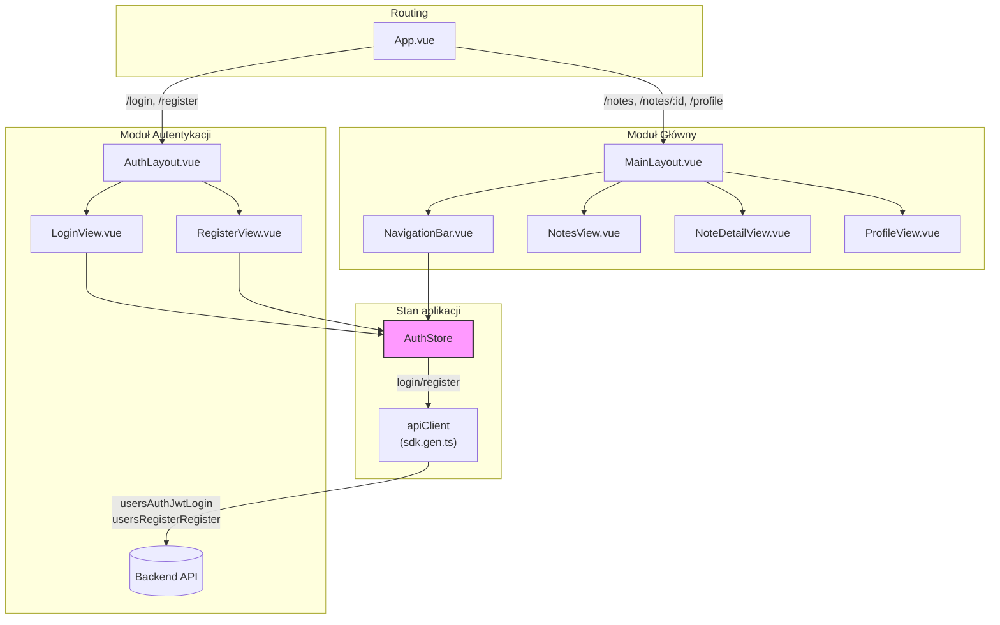

```mermaid
flowchart TD
  classDef state fill:#f9f,stroke:#333,stroke-width:2px;

  subgraph "Stan aplikacji"
    AuthStore["AuthStore"]:::state
    APIClient["apiClient\n(sdk.gen.ts)"]
  end

  subgraph "Routing"
    App["App.vue"]
  end

  App -->|" /login, /register "| AuthLayout["AuthLayout.vue"]
  App -->|" /notes, /notes/:id, /profile "| MainLayout["MainLayout.vue"]

  subgraph "Moduł Autentykacji"
    AuthLayout --> LoginView["LoginView.vue"]
    AuthLayout --> RegisterView["RegisterView.vue"]
    LoginView --> AuthStore
    RegisterView --> AuthStore
    AuthStore -->|login/register| APIClient
    APIClient -->|usersAuthJwtLogin\nusersRegisterRegister| Backend[(Backend API)]
  end

  subgraph "Moduł Główny"
    MainLayout --> NavigationBar["NavigationBar.vue"]
    MainLayout --> NotesView["NotesView.vue"]
    MainLayout --> NoteDetailView["NoteDetailView.vue"]
    MainLayout --> ProfileView["ProfileView.vue"]
    NavigationBar --> AuthStore
  end
```
